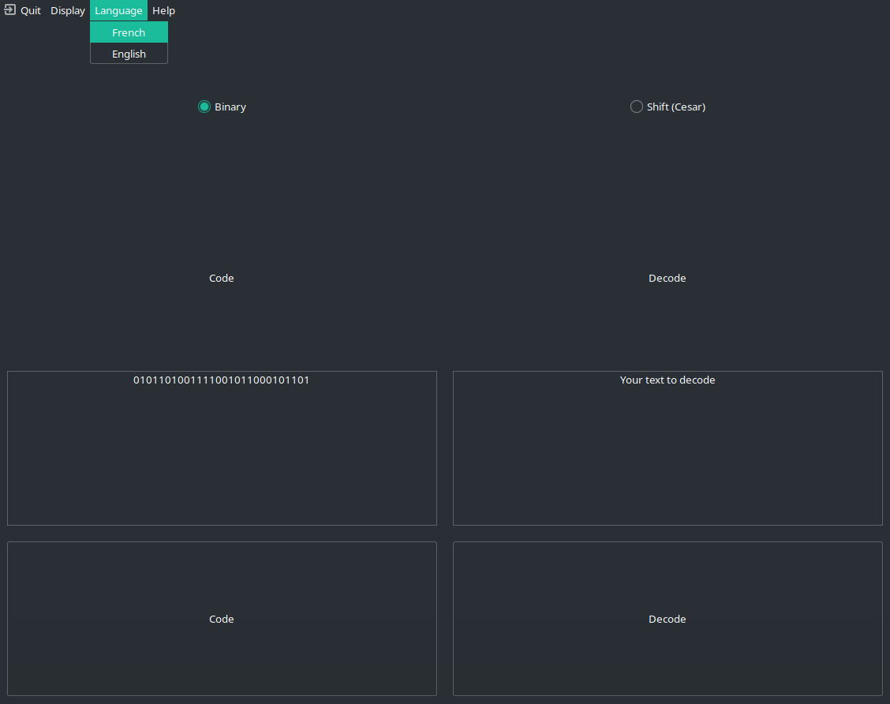

# Small GUI tool to encrypt data with easy method (Cesar...) 

Simple tool to make code / decode of text with GUI interface make with GTK in python.

# Screenshot

# Internationalization, gettext 

Command to generate translatable file from 
>xgettext --sort-output --keyword="translatable,_" -o languages.pot ../code.glade ../main.py

Check encoding in file (need UTF-8) and use 
>msgfmt LANG.pot -o LANG.mo 

To obtain international text.